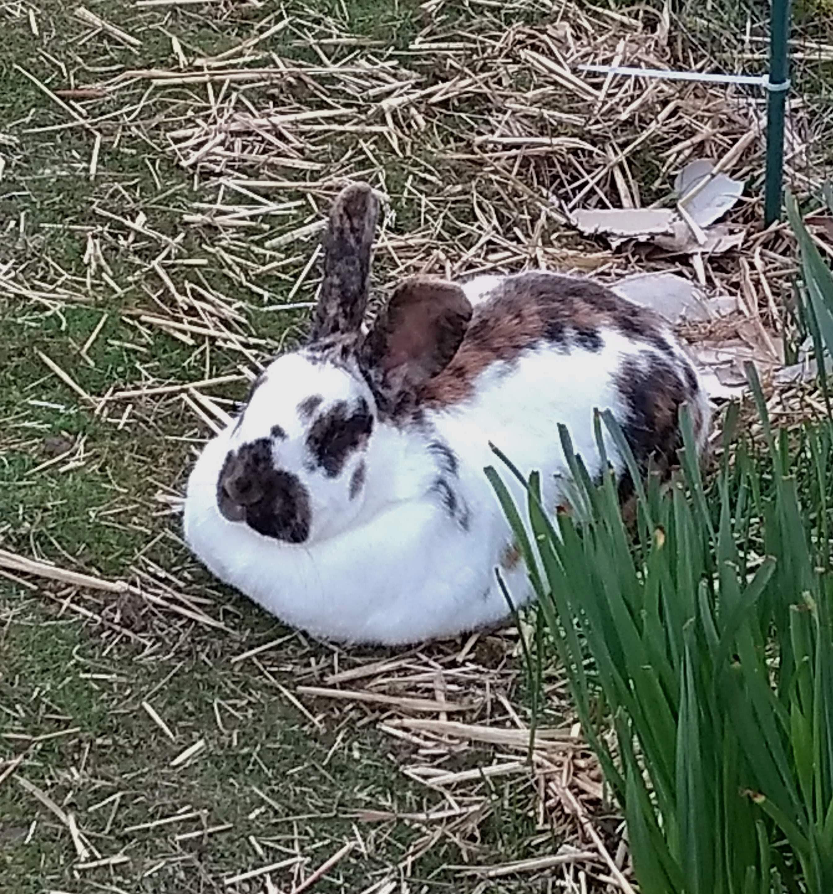

    
    <h1>GoodClover</h1>
    

        <a id="Website" href="https://goodclover.xyz">Website</a>
        •
        
            OSM:
            <a id="OSM User" href="https://www.openstreetmap.org/user/GoodClover">User</a>
            /
            <a id="OSM Wiki" href="https://wiki.openstreetmap.org/wiki/User:GoodClover">Wiki</a>
        
        •
        <a id="Twitter" href="https://twitter.com/_GoodClover_">Twitter</a>
    

    
I don't have any useful projects btw.

    

    <address>
        <label for="Discord">Discord:</label>
        <code id="Discord">GoodClover#5275</code>
         
        <label for="Email">Email:</label>
        <a id="Email" href="mailto:oliversimmo@gmail.com">oliversimmo@gmail.com</a>
    </address>
    

    

